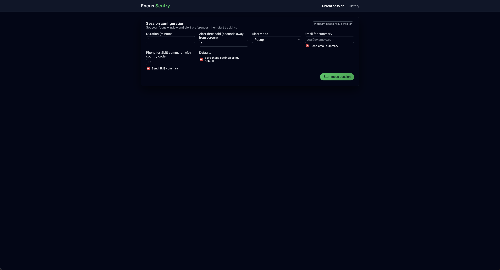
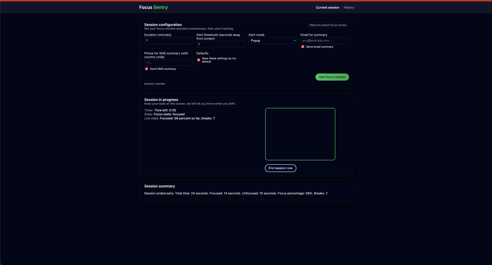
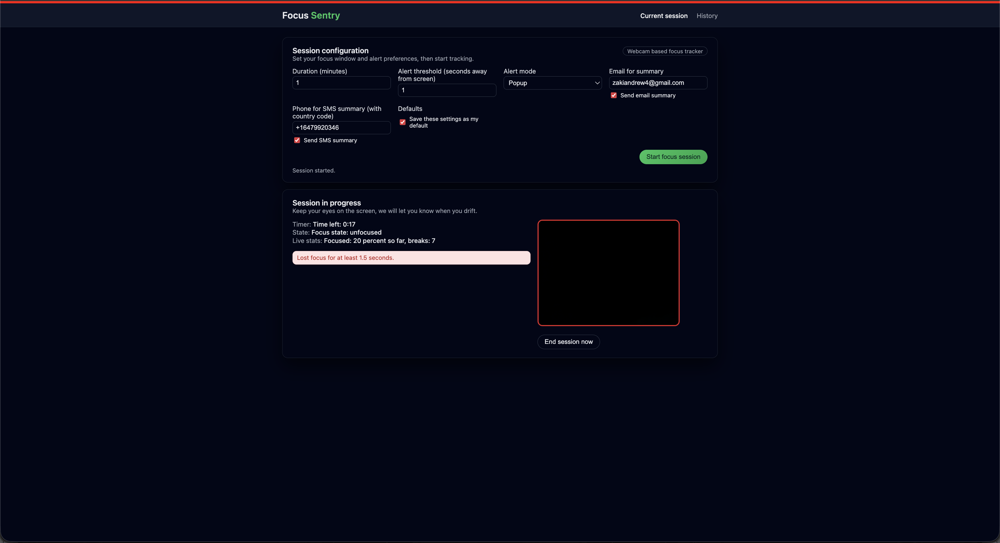
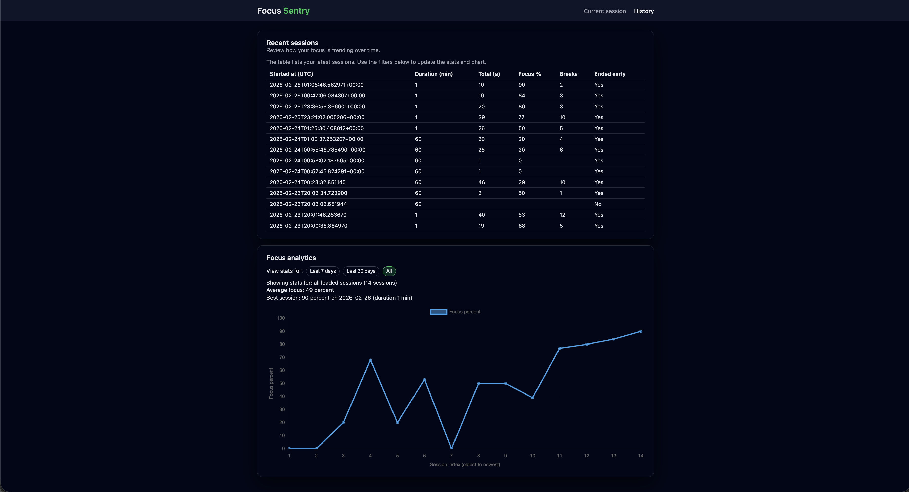
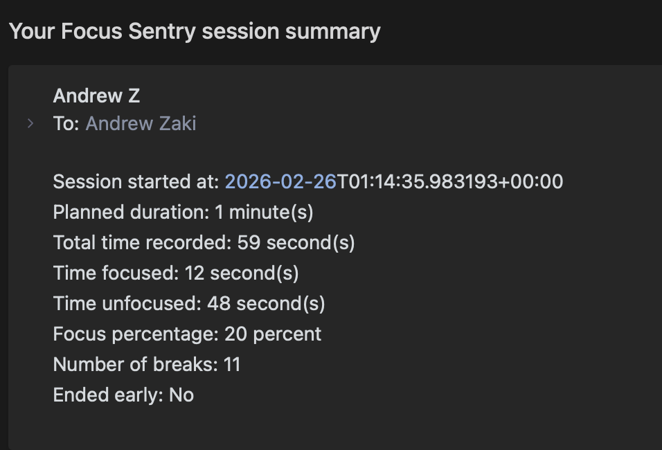
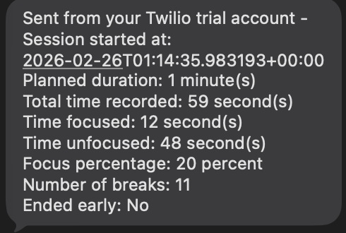

# Focus Sentry

Focus Sentry is an AI powered focus tracking tool that uses your webcam to measure screen attention in real time.  
It detects whether your eyes and head remain oriented toward the display, alerts you when you drift, logs detailed session data, and sends optional email or SMS summaries.

This project demonstrates structured Python backend design, computer vision using ONNX Runtime, a real time browser UI, persistent session history, and optional external integrations.

## Table of Contents
1. Overview  
2. Features  
3. Installation  
4. Running the App  
5. Environment Variables  
6. Email Setup (Gmail SMTP)  
7. SMS Setup (Twilio Free Tier)  
8. Project Structure  
9. Screenshots  
 10. Development Notes  
 11. License

## 1. Overview
Focus Sentry uses your webcam to estimate attention by combining face detection, eye openness checks, and head pose orientation.  
If the user looks away longer than the configured threshold, an alert is shown and unfocused time is recorded.  
At the end of the session, a summary is displayed and can optionally be sent via email or SMS.

## 2. Features
- Web interface with live webcam view  
- Eye openness and head pose based attention classification  
- Real time visual and sound alerts  
- Green and red live focus indicators  
- Live tracking of focused and unfocused time  
- Session summary with total time, breaks, focus percent  
- Email and SMS summary delivery  
- LocalStorage based user defaults  
- Session history and analytics  
- SQLite storage  
- Clean project organization with tests and linting

## 3. Installation

Clone the repository:

```bash
git clone https://github.com/yourusername/focus_sentry.git
cd focus_sentry
```

Create and activate a virtual environment:

```bash
python3 -m venv venv
source venv/bin/activate
```

Install dependencies:

```bash
pip install -r requirements.txt
```

Create your environment file:
	
```bash
cp .env.example .env
```

Edit `.env` and fill in your SMTP and optional Twilio values.

## 4. Running the App

Run the app using uvicorn:

```bash
uvicorn focus_sentry.app:app –reload
```

Open your browser: 
```bash
http://127.0.0.1:8000
```

## 5. Environment Variables

These values are stored in `.env`:

```bash
# SMTP configuration:
FOCUS_SMTP_HOST=smtp.gmail.com
FOCUS_SMTP_PORT=587
FOCUS_SMTP_USERNAME=your_email@gmail.com
FOCUS_SMTP_PASSWORD=your_google_app_password
FOCUS_SMTP_USE_TLS=true
FOCUS_EMAIL_FROM=“Focus Sentry your_email@gmail.com”

# Twilio SMS (optional)

TWILIO_ACCOUNT_SID=ACxxxxxxxxxxxxxxxxxxxxxxxxxxxx
TWILIO_AUTH_TOKEN=your_twilio_auth_token
TWILIO_FROM_NUMBER=+12345550123
```

## 6. Email Setup (Gmail SMTP)

To use Gmail as the email sender:

1. Turn on Two Factor Authentication in your Google account  
2. Go to *Security > App passwords*  
3. Create an App Password with type “Mail”  
4. Copy the 16 character password into `FOCUS_SMTP_PASSWORD`  
5. Use your full Gmail address for `FOCUS_SMTP_USERNAME`  
6. Keep TLS enabled

After this, Focus Sentry can send email summaries.

## 7. SMS Setup (Twilio Free Tier)

Twilio free trial lets you test SMS at no cost, with these restrictions:

- You can only text verified numbers  
- Messages include a “Sent from a Twilio trial account” prefix

Setup:

1. Create a Twilio trial account  
2. Obtain a free trial phone number  
3. Verify your personal phone number  
4. Add SID, Auth Token, and trial phone number into `.env`  
5. Enable “Send SMS summary” in the app interface

This activates SMS summaries during focus sessions.

## 8. Project Structure

```
focus_sentry/
│
├── focus_sentry/
│   ├── detector.py           # ONNX based face and eye state analysis
│   ├── database.py           # SQLite session storage and helpers
│   ├── notifier.py           # Email and SMS summary services
│   ├── app.py                # FastAPI application and endpoints
│   └── __init__.py
│
├── static/
│   ├── main.js               # Frontend frame capture and UI logic
│   ├── styles.css            # Layout, animations, banners, colors
│   └── alert-beep.mp3        # Optional alert sound
│
├── templates/
│   ├── index.html            # Main UI for running sessions
│   └── history.html          # Session history + analytics
│
├── tests/
│   ├── test_start_session.py
│   └── test_end_session.py
│
├── docs/
│   ├── architecture.md       # Backend, UI, and detector architecture
│   ├── sms_setup.md          # Twilio setup guide
│   └── email_setup.md        # SMTP configuration guide
│
├── requirements.txt
├── requirements-dev.txt
├── .env.example
├── README.md
├── pyproject.toml
└── .gitignore
```

## 9. Screenshots

### Dashboard  


### Focus Detection  
  



### Session History  


### Email Summary  


### SMS Summary  


## 10. Development Notes

- Uses ONNX Runtime for lightweight inference  
- Attention classification combines eye openness and head orientation  
- LocalStorage used for user defaults without authentication  
- Ruff and Black enforce consistent style  
- Tests validate session creation and completion  
- SQLite provides easy portability and inspection  
- Clean folder structure for readability and maintainability

## 11. License

MIT License  
Copyright (c) 2026 Andrew Zaki

## Privacy note

All webcam processing happens per frame during the session. Frames are not stored in the database. Only aggregate session statistics are saved.